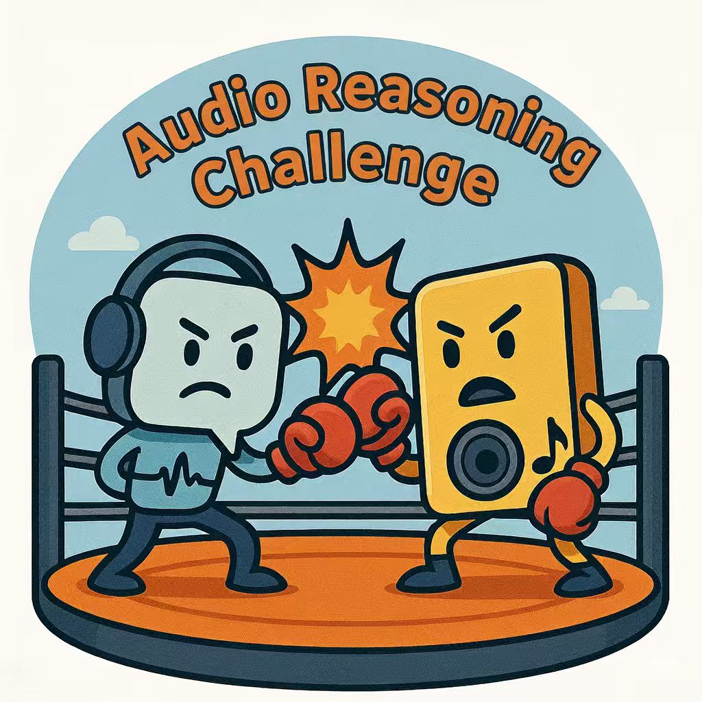
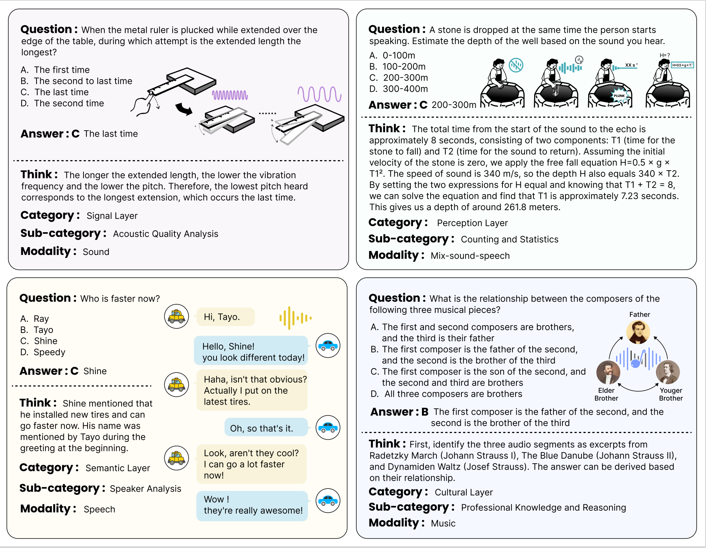

<link href="https://fonts.googleapis.com/css2?family=Inter:wght@400;600;700&display=swap" rel="stylesheet">

<div style="text-align: center; padding: 10px 20px;">
  <div style="margin-bottom: 20px;">
    
  </div>
  <h1 style="font-size: 2em; margin-bottom: 8px; font-weight: 600; font-family: 'Inter', sans-serif; letter-spacing: -0.5px;">Audio Reasoning Challenge</h1>
  <h2 style="color: #666; font-weight: 400; font-size: 1.5em; margin-bottom: 10px; font-family: 'Inter', sans-serif;">Interspeech 2026</h2>
</div>

<!-- News list: placed above Introduction. Replace items as needed -->
<div id="news" style="max-width: 980px; margin: 18px auto; padding: 12px 16px; border-radius: 8px; background: #fff; box-shadow: 0 1px 2px rgba(0,0,0,0.03);">
  <style>
    #news .header { font-family: 'Inter', sans-serif; font-weight: 600; font-size: 1.05em; margin-bottom: 8px; }
    #news ul { list-style: none; padding: 0; margin: 0; }
    #news li { display: flex; gap: 12px; align-items: baseline; padding: 8px 0; border-bottom: 1px solid rgba(0,0,0,0.04); }
    #news li:last-child { border-bottom: none; }
    #news .date { color: #999; font-size: 0.9em; width: 86px; flex-shrink: 0; }
    #news .item { font-size: 0.98em; }
    #news .item a { color: #0b66ff; text-decoration: none; }
    #news .item a:hover { text-decoration: underline; }
    @media (max-width: 520px) {
      #news li { flex-direction: column; align-items: flex-start; }
      #news .date { width: auto; margin-bottom: 4px; }
    }
  </style>

  <div class="header">News</div>
  <ul>
    <li>
      <div class="date">2026-01-01</div>
      <div class="item">Leaderboard <a href="https://www.codabench.org/competitions/12460/" target="_blank">(Single Model Track)</a> and <a href="https://www.codabench.org/competitions/12459/" target="_blank">(Agent Track)</a> goes live! We will send leaderboard registration instructions to teams who have registered <a href="https://docs.google.com/forms/d/e/1FAIpQLScVPtlD08E8lzj18D4ndhLMaEGFDEkVwjVB4EKWEJ0if1mN5g/viewform?usp=header" target="_blank">(link)</a> here.</div>
    </li>
      <li>
      <div class="date">2025-12-31</div>
      <div class="item">Please refer to the <a href="/leaderboard/" target="_blank">Leaderboard</a> page for the detailed evaluation methods.</div>
    </li>
    <li>
      <div class="date">2025-12-03</div>
      <div class="item">Please refer to the <a href="/faqs/" target="_blank">FAQs</a> page for the frequently asked questions.</div>
    </li>
    <li>
      <div class="date">2025-12-01</div>
      <div class="item">Please join our slack and WeChat group for real-time communication in the Contact section.</div>
    </li>
    <li>
      <div class="date">2025-12-01</div>
      <div class="item">Registration <a href="https://docs.google.com/forms/d/e/1FAIpQLScVPtlD08E8lzj18D4ndhLMaEGFDEkVwjVB4EKWEJ0if1mN5g/viewform?usp=header" target="_blank">(link)</a> for teams is open now! The deadline for registration is 2026-01-15. Register early to get latest updates.</div>
    </li>
    <li>
      <div class="date">2025-12-01</div>
      <div class="item">Baselines <a href="https://github.com/Audio-Reasoning-Challenge/Audio-Reasoning-Challenge-Baselines" target="_blank">(link)</a> released!</div>
    </li>
    <li>
      <div class="date">2025-11-25</div>
      <div class="item">Website goes live!</div>
    </li>
  </ul>
</div>

## Introduction

Understanding and reasoning about sound is a fundamental aspect of human intelligence. From spoken conversations and musical compositions to subtle environmental cues, humans can not only perceive a wide variety of auditory signals but also interpret their meanings, draw inferences, and make decisions in complex acoustic scenarios. Replicating this capability in artificial systems has long been a key goal of AI research.

Recent progress in Large Language Models (LLMs), combined with advances in audio processing, has given rise to **Large Audio Language Models (LALMs)**[1-10]. Leveraging large-scale multimodal training and sophisticated architectures, LALMs have achieved impressive results in audio perception tasks such as automatic speech recognition (ASR) and automated audio captioning (AAC). Beyond perception, several recent works have made initial attempts to bring explicit **Chain-of-Thought (CoT) reasoning** into the audio domain, including Audio-CoT[11], Audio-Reasoner[12], Qwen3-Omni-Thinking[13], and Audio Flamingo 3[14], demonstrating improved reasoning performance by integrating advanced cross-modal thinking strategies.

However, despite these advances, **current LALMs still exhibit limited and unstable reasoning capabilities**. Even on established reasoning benchmarks like MMAR[15] and MMAU-Pro[16], they often produce direct answers without presenting the underlying reasoning process, or show inconsistent performance across tasks and inputs. This lack of transparent and reliable reasoning limits interpretability, trustworthiness, and the potential to generalize reasoning ability to unseen audio scenarios.

## Challenge Goals

To address this gap, we have **enriched the MMAR benchmark with manually labeled CoT annotations and explicit reasoning cues**, enabling systematic evaluation of LALMs in reasoning-intensive tasks. Building on this resource, we propose the **Audio Reasoning Challenge at Interspeech 2026**, designed to push LALMs beyond surface-level response accuracy toward robust, interpretable reasoning. 

Our evaluation framework adopts a **stricter criterion: a prediction is considered correct only if both the reasoning path and the final answer are accurate**, ensuring that models are rewarded for genuine, logically consistent thought processes. The challenge features two complementary tracks:

1. **Single Model Track:** Participants can use open-source data to post-train open-source models, focusing on intrinsic model reasoning capabilities.
2. **Agent Track:** Participants can use open-source models to build an agent system or pipeline without human-in-the-loop, emphasizing system-level orchestration and tool use.

<div style="text-align: center; margin: 40px 0;">
  
  <p style="margin-top: 12px; color: #666; font-size: 14px; font-style: italic;">Examples (with CoT annotated) from the MMAR benchmark, spanning audio, speech, music, and their mix, and illustrating challenges at the signal, perceptual, semantic, and cultural levels.</p>
</div>

<!-- ### Why This Challenge Matters

**1. Strict, Reasoning-First Evaluation**  
A prediction is correct only if both the CoT path and the final answer are accurate. This closes the "answer-only" loophole, directly targeting shallow pattern matching and rewarding faithful, stepwise reasoning in large audio language models.

**2. Comprehensive Real-World Coverage**  
The challenge operationalizes LALM reasoning breadth through 1,000 real-world items spanning speech, sound, music, and their mixtures, hierarchically organized across signal, perception, semantic, and cultural layers. This multi-level design stresses compositional, cross-domain reasoning that better reflects real use cases than single-domain benchmarks. **Importantly, it aligns with Interspeech 2026's "Speaking Together" theme by bridging communities across speech, audio, music, and reasoning to build trustworthy, explainable audio-language systems.**

**3. Two Complementary Perspectives**  
The single model and agent tracks enable rigorous comparisons between monolithic LALMs and tool-using/plan-execute agents. This disentangles pure model reasoning from orchestration and tool-use, offering clearer insights into where reasoning gains originate.

**4. Community-Driven Progress**  
By releasing CoT annotations, baseline systems, and transparent scoring scripts (including reasoning-path validation), the challenge promotes reproducibility, error analysis, and principled progress in audio reasoning research. -->

## Challenge Tracks

### Track 1: Single Model Track

Participants build a **single, end-to-end Audio–Language Model** that consumes the audio and produces (i) a Chain-of-Thought (CoT) reasoning trace and (ii) a final answer. Systems must perform **intrinsic reasoning within one forward** without delegating to external tools, APIs, search engines, or separate controllers. The goal is to isolate **model-internal reasoning** quality under our strict criterion: a prediction is counted correct only if both the CoT and the final answer are validated.

[Learn more about Track 1](track1)

### Track 2: Agent Track

Participants design an **audio reasoning agent** that may orchestrate **multiple open-source models and tools** (e.g., ASR, separation, beat/onset tracking, captioners, planners) to produce a CoT path and a final answer. This track evaluates **system-level reasoning**: planning, tool selection, and self-checking under the same strict correctness criterion. The emphasis is on transparent trajectories that reveal how intermediate audio analyses contribute to decisions, moving beyond answer-only pipelines.

[Learn more about Track 2](track2)

## Benchmark and Evaluation Protocol

### Benchmark

All submissions will be evaluated on the updated version of **MMAR benchmark**, a 1,000-item dataset designed for deep audio reasoning across speech, sound, music, and mixed-modality scenarios. Each sample contains audio, a question, a ground-truth answer, and a newly annotated CoT rationale.

### Submission Format

Participants must submit a JSONL file to the online leaderboard, where each line contains:

```json
{
  "id": "<sample_id>",
  "thinking_prediction": "<model_or_agent_generated_CoT>",
  "answer_prediction": "<final_prediction>"
}
```

The leaderboard will automatically compute all metrics and rank systems by the primary score.

### Evaluation Metrics

1. **Answer Correctness**: If the `answer_prediction` is **incorrect**, the score is **0**.
2. **Reasoning Quality**: If the answer is **correct**, an LLM-as-a-judge evaluates the `thinking_prediction` on a scale of **0.2 to 1.0** (in 0.2 increments).
3. **Stability Mechanism**: To account for variance, each submission is calculated based on **5 independent evaluation runs**. The final score for each metric will be **the mean of the 3 middle runs**, effectively discarding the highest and lowest results.

<!-- We adopt a two-stage scoring protocol that jointly assesses **Answer Correctness** and **Reasoning Quality**.

- **Metric 1: Reasoning Score (Primary)**  
  1. If the **`answer_prediction`** is **incorrect**, the model's score is immediately set to **0**.
  2. If the **`answer_prediction`** is **correct**, the score is assigned based on the quality of the **`thinking_prediction`**. Scores are assigned in 0.2 increments, from **0.2** to **1.0**.
  3. This metric is computed using an LLM-as-a-judge protocol with carefully designed evaluation criteria for consistency and reliability.

- **Metric 2: Cue Score**  

$$
  \text{Cue Score} = \frac{\#\text{correct cues mentioned}}{\#\text{all ground-truth cues}}
$$

  1. We measure the proportion of correctly recovered reasoning cues within the generated CoT.
  2. This captures how well a model identifies perceptual and structural evidence in the audio, even if its final answer is incorrect. 
  
Not that systems are ranked by **Metric 1**. Metric 2 is used for tie-breaking and qualitative leaderboard highlights (e.g., "Best Evidence Alignment"). Both Metric 1 and Metric 2 scores will be calculated **based on 5 evaluation runs**. The final score for each metric will be **the mean of the 3 middle runs**, effectively discarding the highest and lowest results.  -->

## Registration and Leaderboard
Registration for the leaderboard and Google Form submission are required. Refer to the Leaderboard tab for more details. 

[Learn more about Leaderboard](leaderboard)

## Paper submission

Participants can submit a paper describing the submitted model or system to the Interspeech 2026. Submissions describing the competition systems or reporting research results based on the competition benchmark are equally welcome. The submitted papers will go through the same review process as the regular papers and will be indexed and included in the ISCA archive. 

[Learn more about Timeline](timeline)

## Contact
We have a Slack channel and a WeChat group for real-time communication. Please send an [email](mailto:zym.22@sjtu.edu.cn) if you have any private questions. 

<!-- QR codes (Slack / WeChat) -->
<div style="max-width: 720px; margin: 14px auto 22px; display:flex; gap:20px; justify-content:center; align-items:flex-start; flex-wrap:wrap;">
  <div style="text-align:center; min-width: 150px;">
    
    <div style="margin-top:8px; color:#666; font-size:13px;">Slack Channel</div>
    <div style="font-size:12px; margin-top:4px;"><a href="https://join.slack.com/t/arc-is26/shared_invite/zt-3j95gc30m-hZoEdpejS4XyZnDP9eWrvA" target="_blank">Join Slack</a></div>
  </div>
  <div style="text-align:center; min-width: 150px;">
    
    <div style="margin-top:8px; color:#666; font-size:13px;">WeChat Group</div>
    <div style="font-size:12px; margin-top:4px; color:#666;">Scan to join</div>
  </div>
</div>

## Organizers

<!-- New responsive organizers block: replace image paths/names/affiliations as needed -->
<div id="organizers" style="max-width: 980px; margin: 24px auto 60px; padding: 0 16px;">
  <style>
    /* simple responsive grid + item layout */
    #organizers .grid {
      display: grid;
      grid-template-columns: 1fr;
      gap: 18px;
    }
    @media (min-width: 720px) {
      #organizers .grid {
        grid-template-columns: 1fr 1fr;
      }
    }
    #organizers .organizer {
      display: flex;
      align-items: center;
      gap: 14px;
      background: #fff;
      padding: 12px;
      border-radius: 8px;
      box-shadow: 0 1px 2px rgba(0,0,0,0.04);
    }
    #organizers .organizer img {
      width: 88px;
      height: 88px;
      object-fit: cover;
      border-radius: 8px;
      flex-shrink: 0;
      background: #f2f2f2;
    }
    #organizers .organizer .meta {
      text-align: left;
    }
    #organizers .organizer .name {
      font-family: 'Inter', sans-serif;
      font-weight: 600;
      font-size: 1.2em;
      margin-bottom: 4px;
    }
    #organizers .organizer .affil {
      color: #666;
      font-size: 0.8em;
      line-height: 1.2;
    }

  </style>

  <div class="grid">
    <div class="organizer">
      
      <div class="meta">
        <div class="name">
          <a href="http://ziyang.tech/" target="_blank">Ziyang Ma</a>
        </div>
        <div class="affil">Shanghai Jiao Tong University</div>
        <div class="affil">Nanyang Technological University</div>
      </div>
    </div>
    <div class="organizer">
      
      <div class="meta">
        <div class="name">
          <a href="https://nicolaus625.github.io/" target="_blank">Yinghao Ma</a>
        </div>
        <div class="affil">Queen Mary University of London</div>
      </div>
    </div>
    <div class="organizer">
      
      <div class="meta">
        <div class="name">
          <a href="https://huckiyang.github.io/" target="_blank">Chao-Han Huck Yang</a>
        </div>
        <div class="affil">NVIDIA Research</div>
      </div>
    </div>
    <div class="organizer">
      
      <div class="meta">
        <div class="name">
          <a href="https://scholar.google.com/citations?hl=en&user=dCADJl0AAAAJ" target="_blank">Ruiyang Xu</a>
        </div>
        <div class="affil">Shanghai Jiao Tong University</div>
      </div>
    </div>
    <div class="organizer">
      
      <div class="meta">
        <div class="name">
          <a href="https://scholar.google.com/citations?hl=en&user=ci5K3f4AAAAJ" target="_blank">Bohan Li</a>
        </div>
        <div class="affil">Shanghai Jiao Tong University</div>
      </div>
    </div>
    <div class="organizer">
      
      <div class="meta">
        <div class="name">
          <a href="https://jaeyeonkim99.github.io/" target="_blank">Jaeyeon Kim</a>
        </div>
        <div class="affil">Carnegie Mellon University</div>
      </div>
    </div>
    <div class="organizer">
      
      <div class="meta">
        <div class="name">
          <a href="https://jxu-thu.github.io/" target="_blank">Jin Xu</a>
        </div>
        <div class="affil">Alibaba Group</div>
      </div>
    </div>
    <div class="organizer">
      
      <div class="meta">
        <div class="name">
          <a href="https://www.microsoft.com/en-us/research/people/jinyli/" target="_blank">Jinyu Li</a>
        </div>
        <div class="affil">Microsoft Corporation</div>
      </div>
    </div>
    <div class="organizer">
      
      <div class="meta">
        <div class="name">
          <a href="https://carlosbusso.com/" target="_blank">Carlos Busso</a>
        </div>
        <div class="affil">Carnegie Mellon University</div>
      </div>
    </div>
    <div class="organizer">
      
      <div class="meta">
        <div class="name">
          <a href="https://x-lance.sjtu.edu.cn/~kaiyu/" target="_blank">Kai Yu</a>
        </div>
        <div class="affil">Shanghai Jiao Tong University</div>
      </div>
    </div>
    <div class="organizer">
      
      <div class="meta">
        <div class="name">
          <a href="https://aseschng.github.io/intro1.html" target="_blank">Eng Siong Chng</a>
        </div>
        <div class="affil">Nanyang Technological University</div>
      </div>
    </div>
    <div class="organizer">
      
      <div class="meta">
        <div class="name">
          <a href="https://chenxie95.github.io/en" target="_blank">Xie Chen</a>
        </div>
        <div class="affil">Shanghai Jiao Tong University</div>
      </div>
    </div>
  </div>
</div>


<!-- References: add after Organizers -->
<div id="references" style="max-width: 980px; margin: 12px auto 40px; padding: 16px; border-radius: 8px; background:#fff; box-shadow: 0 1px 2px rgba(0,0,0,0.03);">
  <style>
    #references h2 { font-family: 'Inter', sans-serif; font-size: 1.1em; margin: 0 0 10px; }
    #references ol { margin: 0; padding-left: 20px; color: #333; }
    #references li { margin: 8px 0; font-size: 0.95em; line-height: 1.4; }
    #references a { color: #0b66ff; text-decoration: none; }
    #references a:hover { text-decoration: underline; }
  </style>

  <h2>References</h2>
    <li id="ref-1">[1] Gong, Yuan, et al. "Joint audio and speech understanding." Proc. ASRU (2023).</li>
    <li id="ref-2">[2] Tang, Changli, et al. "SALMONN: Towards generic hearing abilities for large language models." Proc. ICLR (2024).</li>
    <li id="ref-3">[3] Chu, Yunfei, et al. "Qwen-Audio: Advancing universal audio understanding via unified large-scale audio-language models." arXiv preprint arXiv:2311.07919 (2023).</li>
    <li id="ref-4">[4] Chu, Yunfei, et al. "Qwen2-Audio technical report." arXiv preprint arXiv:2407.10759 (2024).</li>
    <li id="ref-5">[5] Ghosh, Sreyan, et al. "GAMA: A large audio-language model with advanced audio understanding and complex reasoning abilities." Proc. EMNLP (2024).</li>
    <li id="ref-6">[6] Kong, Zhifeng, et al. "Audio Flamingo: A novel audio language model with few-shot learning and dialogue abilities." Proc. ICML (2024).</li>
    <li id="ref-7">[7] Ghosh, Sreyan, et al. "Audio Flamingo 2: An audio-language model with long-audio understanding and expert reasoning abilities." Proc. ICML (2025).</li>
    <li id="ref-10">[8] Huang, Ailin, et al. "Step-Audio: Unified understanding and generation in intelligent speech interaction." arXiv preprint arXiv:2502.11946 (2025).</li>
    <li id="ref-8">[9] Xu, Jin, et al. "Qwen2.5-Omni technical report." arXiv preprint arXiv:2503.20215 (2025).</li>
    <li id="ref-9">[10] Ding, Ding, et al. "Kimi-Audio technical report." arXiv preprint arXiv:2504.18425 (2025).</li>
    <li id="ref-1">[11] Ma, Ziyang, et al. "Audio-CoT: Exploring chain-of-thought reasoning in large audio language model." Proc. ASRU (2025).</li>
    <li id="ref-2">[12] Zhifei, Xie, et al. "Audio-Reasoner: Improving Reasoning Capability in Large Audio Language Models." Proc. EMNLP (2025). </li>
    <li id="ref-3">[13] Xu, Jin, et al. "Qwen3-Omni technical report." arXiv preprint arXiv:2509.17765 (2025).</li>
    <li id="ref-4">[14] Goel, Arushi, et al. "Audio flamingo 3: Advancing audio intelligence with fully open large audio language models." arXiv preprint arXiv:2507.08128 (2025).</li>
    <li id="ref-5">[15] Ma, Ziyang, et al. "MMAR: A Challenging Benchmark for Deep Reasoning in Speech, Audio, Music, and Their Mix." Proc. NeurIPS (2025).</li>
    <li id="ref-6">[16] Kumar, Sonal, et al. "MMAU-Pro: A challenging and comprehensive benchmark for holistic evaluation of audio general intelligence." arXiv preprint arXiv:2508.13992 (2025).</li>
</div>

---

<div style="text-align: center; margin-top: 60px; color: #888;">
  <p>Follow us on GitHub for updates: 
    <a href="https://github.com/Audio-Reasoning-Challenge">@Audio-Reasoning-Challenge</a>
  </p>
</div>